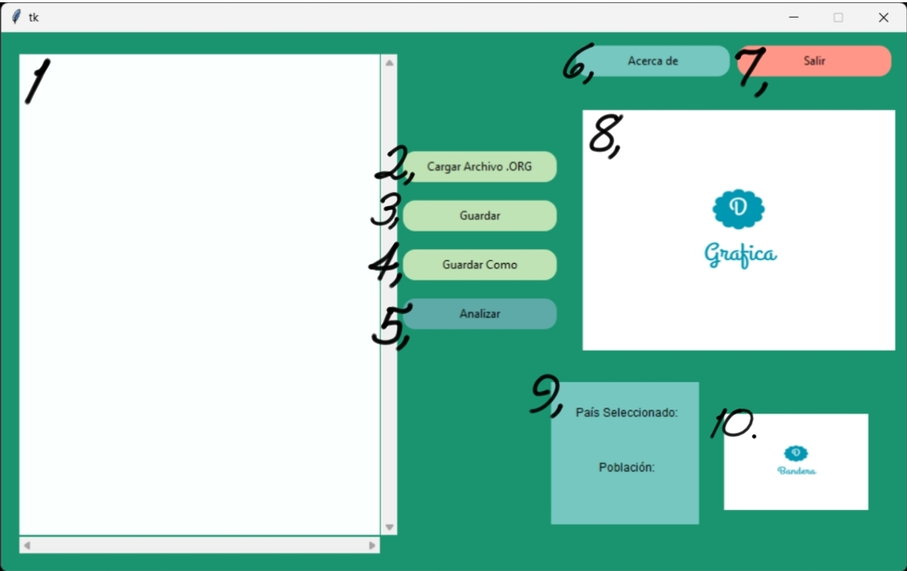
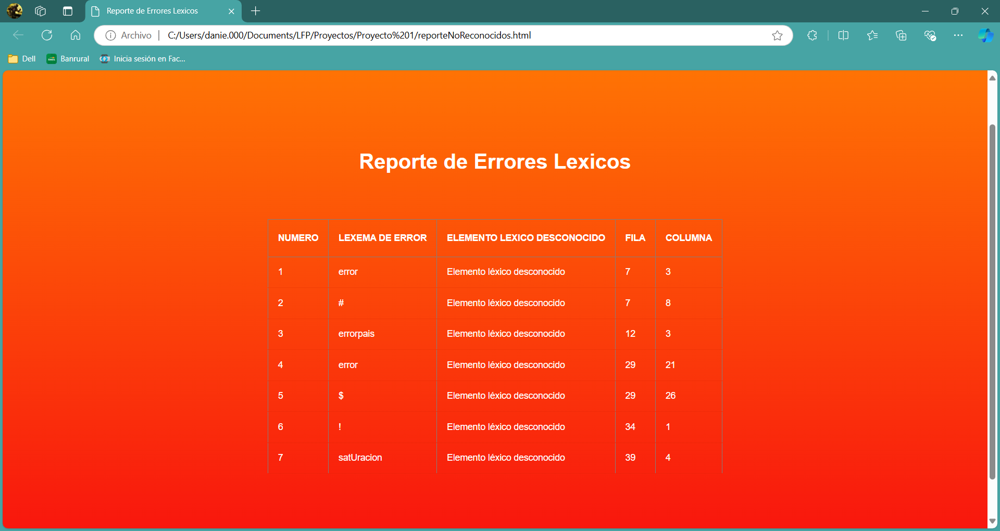

# Manual De Usuario
Bienvenido querido usuario, este documento te brindará la información importante para utilizar el software desarrollado para escoger la mejor opción sobre la ubicación, fundamentado en las características de los datos obtenidos de cada país. El objetivo del presente es explicar las funcionalidades del programa.  

---

## Requisitos del Sistema
- Windows 10/11 :white_check_mark: 
- Versión de Python 3.12.3 o superiores :white_check_mark:
- Versión de Fortran (GCC) 14.10 o superiores :white_check_mark:
- 4 GB de memoria RAM :white_check_mark:
- Mínimo 4 MB de almacenamiento para la ejecución del programa :white_check_mark:
---
## Ejecución :arrow_forward:
Al ejecutar el programa se mostrará esta ventana:


1. Área de texto: Su funcionalidad es que el usuario pueda visualizar los archivos cargados al programa, además de poder modificarlos.
2. "Cargar Archivo": nos permite ingresar a nuestro explorador de archivos y seleccionar el archivo que deseamos analizar.  
3. "Guardar": nos permite sobreescribir en el archivo
4. "Guardar Como": su función es crear una copia del archivo actual y nos permite almacenarla donde querramos
5. "Analizar": Es el botón que inciará todo el proceso para seleccionar el país
6. "Acerca de": Aquí encontrarás información acerca del desarrollador
7. "Salir": Detiene la ejecución del programa
8. Área de la gráfica: en esta zona de mostrará la gráfica de despliegue con los continentes y países
9. Área de información: muestra la información del país seleccionado
10. Área de bandera: muestra la imagen de la bandera del país seleccionado
---
## Ejemplo del Archivo de Entrada :arrow_double_down:

```
grafica:{
	nombre:"Corto #1";
	continente:{
	nombre: "America del Norte";
		pais:{
		nombre:"Canada";
			poblacion: 35295;
			saturacion:75%;
			bandera: "C:\banderas\ca.png";
		}
		pais:{
		nombre:"Mexico";
			poblacion: 119713;
			saturacion:35%;
			bandera: "C:\banderas\mx.png";
		}
		pais:{
		nombre:"Estados unidos";
			poblacion: 512300;
			saturacion:73%;
			bandera: "C:\banderas\us.png";
		}
	}
	continente:{
	nombre: "America del Sur";
		pais:{
			nombre:"Cabo verde";
			poblacion: 35000;
			saturacion:99%;
			bandera: "C:\banderas\cv.png";
		}
	}
	continente:{
	nombre: "Oceania";
		pais:{
			nombre:"Indonesia";
			poblacion: 55000;
			saturacion:74%;
			bandera: "C:\banderas\mc.png";
		}
	}
}
```
---
## Ejemplo de ejecución :arrows_clockwise:
#### Programa Inicial:

#### Mensaje de confirmación:

#### Salida del programa:


## Ejemplo de Grafica Generada


## Ejemplo de HTML Generado


## En caso de error :no_entry:
En caso de que la entrada contenga errores, solo se generárá el HTML que le dará una lista de los errores léxicos encontrados


Con esto esperamos que el usuario sea capaz de usar el programa.
Para obtener soporte contactarse al:


**+502 5454-4306**
**Developer: Daniel Hernandez**:turtle: