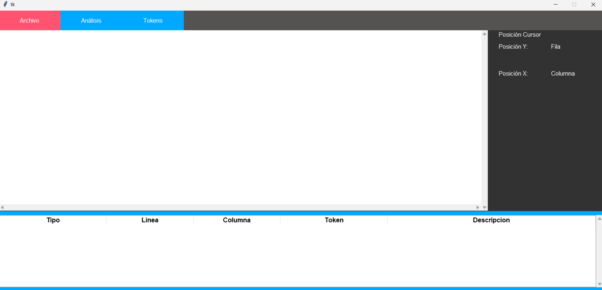
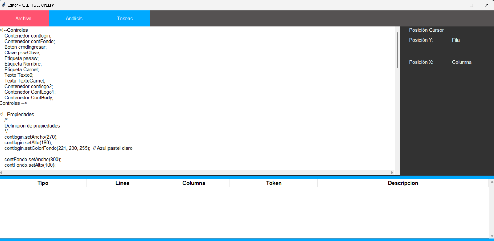
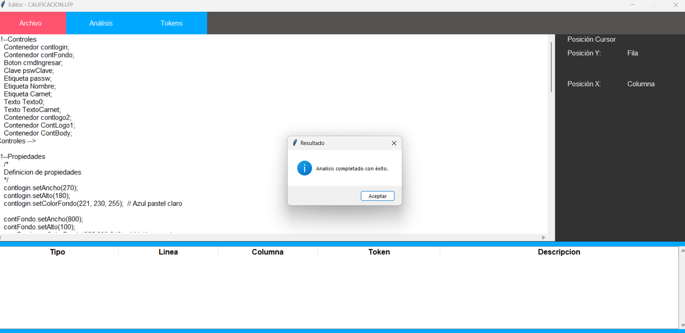
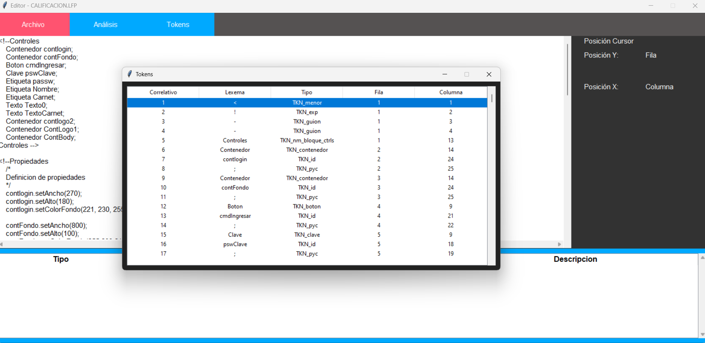
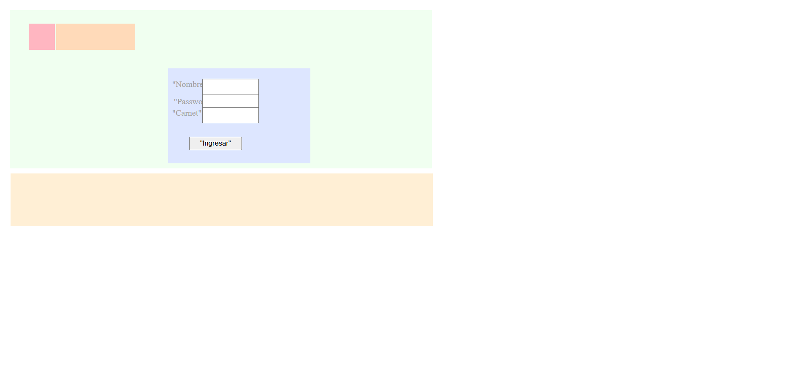
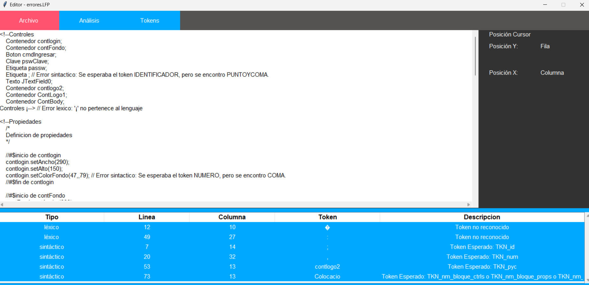

# Manual De Usuario
Bienvenido querido usuario, este documento te brindará la información importante para utilizar el software desarrollado para la creación de páginas web de HTML y CSS. El objetivo del presente es explicar las funcionalidades del programa.  

---

## Requisitos del Sistema
- Windows 10/11 :white_check_mark: 
- Versión de Python 3.12.3 o superiores :white_check_mark:
- Versión de Fortran (GCC) 14.10 o superiores :white_check_mark:
- 4 GB de memoria RAM :white_check_mark:
- Mínimo 4 MB de almacenamiento para la ejecución del programa :white_check_mark:
---
## Ejecución :arrow_forward:
Al ejecutar el programa se mostrará esta interfaz:



1. Área de texto: Su funcionalidad es que el usuario pueda visualizar los archivos cargados al programa, además de poder modificarlos.
2. "Archivo": despliega una serie de botones que tiene cierta funcionalidad: 
- "Nuevo": Su función es crear un archivo nuevo 
- "Abrir": podremos seleccionar que archivo de entrada queremos ingresar
- "Guardar": nos permite sobreescribir en el archivo
- "Guardar Como": su función es crear una copia del archivo actual y nos permite almacenarla donde querramos
- "Salilr": termina la ejecución del programa
3. "Analizar": Es el botón que inciará todo el proceso para crear la nueva página web
4. "Token" : brindará una lista que mostrará todos los tokens reconocidos
8. Barra Lateral Derecha: en esta zona de mostrará la posición de columna y fila del cursor, para mejor manipulación de archivos
9. Tabla Inferior: muestra la información de los errores Sintácticos o Léxicos identificados en caso existan 
---
## Ejemplo del Archivo de Entrada :arrow_double_down:

```
<!--Controles
    Contenedor contlogin;
    Contenedor contFondo;
    Boton cmdIngresar;
    Clave pswClave;
    Etiqueta passw;
    Etiqueta Nombre;
    Etiqueta Carnet;
    Texto Texto0;
    Texto TextoCarnet;
    Contenedor contlogo2;
    Contenedor ContLogo1;
    Contenedor ContBody;
Controles -->

<!--Propiedades
    /*
    Definicion de propiedades
    */
    contlogin.setAncho(270);
    contlogin.setAlto(180);
    contlogin.setColorFondo(221, 230, 255);  // Azul pastel claro

    contFondo.setAncho(800);
    contFondo.setAlto(100);
    contFondo.setColorFondo(255,239,213);  // Melón pastel

    cmdIngresar.setTexto("Ingresar");

    pswClave.setTexto("");

    passw.setAncho(53);
    passw.setAlto(13);
    passw.setColorLetra(160,160,160);  // Gris pastel
    passw.setTexto("Password");

    Nombre.setAncho(44);
    Nombre.setAlto(13);
    Nombre.setColorLetra(160,160,160);  // Gris pastel
    Nombre.setTexto("Nombre");

    Carnet.setAncho(44);
    Carnet.setAlto(13);
    Carnet.setColorLetra(160,160,160);  // Gris pastel
    Carnet.setTexto("Carnet");

    Texto0.setTexto("");
    TextoCarnet.setTexto("");

    contlogo2.setAncho(150);
    contlogo2.setAlto(50);
    contlogo2.setColorFondo(255,218,185);  // Durazno pastel

    ContLogo1.setAncho(50);
    ContLogo1.setAlto(50);
    ContLogo1.setColorFondo(255,182,193);  // Rosa pastel

    ContBody.setAncho(800);
    ContBody.setAlto(300);
    ContBody.setColorFondo(240,255,240);  // Verde menta pastel

Propiedades -->

<!--Colocacion
    /*
    Posicionamiento de los controles
    */
    contFondo.setPosicion(25,330);
    this.add(contFondo);
    contlogin.setPosicion(300,110);
    ContBody.add(contlogin);
    passw.setPosicion(11,54);
    contlogin.add(passw);
    cmdIngresar.setPosicion(40,130);  // Ajustado para dar espacio al nuevo campo Carnet
    pswClave.setPosicion(65,48);
    contlogin.add(pswClave);

    Nombre.setPosicion(8,21);
    contlogin.add(Nombre);
    Texto0.setPosicion(65,20);
    contlogin.add(Texto0);

    Carnet.setPosicion(8,75);  // Posicionando Carnet debajo de los otros campos
    TextoCarnet.setPosicion(65,74);
    contlogin.add(Carnet);
    contlogin.add(TextoCarnet);

    contlogin.add(cmdIngresar);
    contlogo2.setPosicion(88,25);
    ContBody.add(contlogo2);
    ContLogo1.setPosicion(36,25);
    ContBody.add(ContLogo1);
    ContBody.setPosicion(23,21);
    this.add(ContBody);
Colocacion -->

```
---
## Ejemplo de ejecución :arrows_clockwise:
#### Programa Inicial:

#### Mensaje de confirmación:

#### Tabla de Tokens:


## Ejemplo de Página Generada


## En caso de error :no_entry:
En caso de que la entrada contenga errores, se mostrarán en la tabla inferior
!

Con esto esperamos que el usuario sea capaz de usar el programa.
Para obtener soporte contactarse al:


**+502 5454-4306**
**Developer: Daniel Hernandez**:turtle: